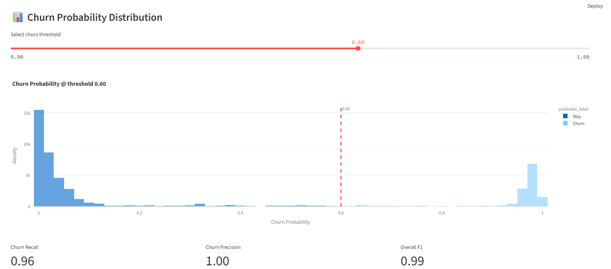

# 🚀 Churn Prediction App

[](https://www.python.org/)  
[](https://share.streamlit.io/)  
[](./LICENSE)

---

## 🤔 Project Context  

In competitive telecom markets, retaining a customer costs up to five times less than acquiring a new one.  
This app analyzes usage, billing, and demographic data with an XGBoost model to predict churn risk.

- Data: 5,000+ records with 30+ features (tenure, charges, contract type, etc.)  
- Goal: Enable targeted retention campaigns via early warnings  
- Impact: A 5% lift in retention can save hundreds of thousands annually  
- Users: Product managers, data analysts, customer-success teams  

---

## 📖 Overview  

A Streamlit dashboard that predicts customer churn using XGBoost. It offers interactive charts and a threshold slider to tune recall vs. precision.  


---

## ✨ Features  

- Adjustable probability threshold  
- Plotly-powered feature importances  
- CSV upload for custom scoring  
- Downloadable scored output  

---

## 🛠 Tech Stack  

Python 3.9+ • Streamlit • XGBoost • joblib • Pandas • Plotly  

---

## 🚀 Getting Started

### Clone & install
```bash
git clone https://github.com/Bongani-Cyprian/customer-churn-data-analyses-prediction.git
cd customer-churn-data-analyses-prediction
python -m venv .venv
.\.venv\Scripts\activate    # Windows
pip install -r requirements.txt
